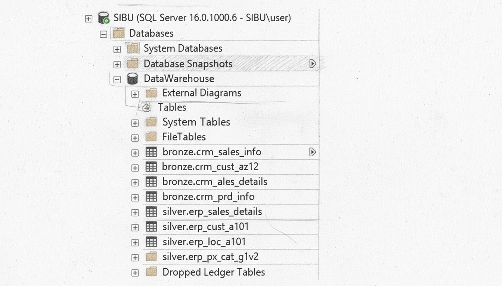
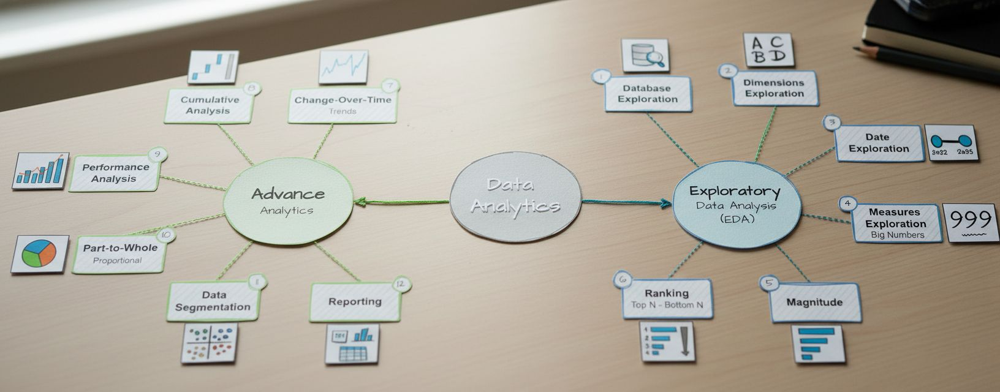

# SQL Data Analytics Project

A structured and comprehensive collection of SQL scripts built for data exploration, analytics, and reporting. This repository equips data analysts and BI professionals with practical, ready-to-run SQL queries to explore relational databases, analyze key metrics, identify trends, and uncover actionable insights.

## 📑 Table of Contents

1.  Overview
2.  Exploratory Data Analysis (EDA)
3.  Advanced Analytics
4.  License
5.  About Me

## 📈 Project Road Map

## Overview

This project serves as a practical SQL toolkit for anyone working with
relational data.

## 🔍 Exploratory Data Analysis (EDA)

EDA is the essential first phase of any analytics project. It focuses on
understanding raw data, discovering early patterns, and ensuring the
dataset is dependable before deeper insights or modeling.

- Database Exploration

Investigate the underlying database structure, including tables,
schemas, and relationships. This prevents incorrect assumptions and
ensures clarity on data origin and integrity.

- Dimensions Exploration

Analyze descriptive fields such as customer groups or regions. This
helps reveal distributions, unique values, and segmentation
opportunities while preventing biased analysis later.

- 📊 Data Exploration

Review summary statistics, detect missing values, and identify outliers.
This step evaluates whether the dataset is clean, complete, and ready
for analysis.

- 📏 Measures Exploration

Examine quantitative metrics like revenue, sales, or counts.
Understanding averages, variability, and correlations helps shape
hypotheses and determine key drivers.

- 📐 Magnitude Analysis

Evaluate the size and scale of metrics---such as comparing total sales
over years---to provide proper context and prevent misleading
interpretations.

- 🏆 Ranking

Sort data to highlight top and bottom performers. Ranking is essential
for prioritization and identifying strengths or weaknesses.

------------------------------------------------------------------------

- 📈 Advanced Analytics

Once EDA is complete, more advanced techniques extract deeper insights,
forecast trends, and support strategic planning.

- ⏳ Change‑Over‑Time Trends

Analyze how metrics shift across time to reveal growth patterns,
seasonality, and long‑term changes.

- 🔄 Cumulative Analysis

Use running totals and accumulated values to assess long‑term
contribution and performance, avoiding narrow short‑term conclusions.

- ⚙️ Performance Analysis

Evaluate outcomes against KPIs or benchmarks to pinpoint inefficiencies
and optimization opportunities.

- 🧩 Part‑to‑Whole Analysis

Break down totals into contributing components to understand
proportional impact, dependencies, and structural distribution.

- 🎯 Data Segmentation

Divide datasets into meaningful groups based on demographics, behavior,
or other characteristics. This supports personalization and uncovers
hidden patterns.

- 📤 Reporting

Translate insights into reports, dashboards, or summaries designed for clear communication---especially for non‑technical audiences.

## 🛡️ License

This project is licensed under the MIT License.

## 🌟 About Me

Hi! I'm **Sibu Mgidi**, a Data Engineer passionate about transforming
raw data into insights.

This project is inspired **Baraa Khatib Salkini (Data With Baraa)**:
[YouTube](http://bit.ly/3GiCVUE)
